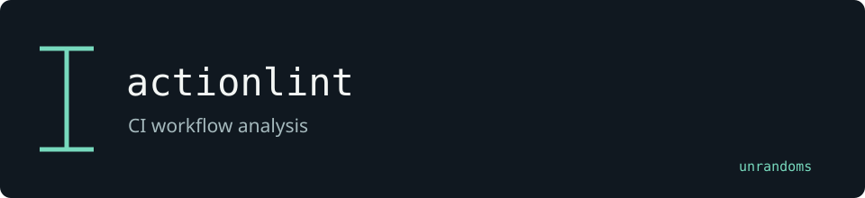

# actionlint

Checks GitHub Actions workflows and includes a separate GitLab CI parser. The local extensions add SARIF output and checks around unmasked secrets.

Maintained by [unrandoms](https://github.com/unrandoms), derived from [rhysd/actionlint](https://github.com/rhysd/actionlint).

## Fork-specific work

- [`gitlabci/gitlabci.go`](gitlabci/gitlabci.go)
- [`rule_unmasked_secret.go`](rule_unmasked_secret.go)
- [`sarif.go`](sarif.go)

## Validation and limits

This repository also serves as a contribution fork. The upstream Go module name is retained for compatibility.

This documentation update does not certify all inherited features. The [archived reference](UPSTREAM_README.md) describes the original ecosystem; its package names and release links may target upstream rather than this fork.

## Credits

See [CREDITS.md](CREDITS.md) for the distinction between the original implementation and this fork's adaptations. Original licenses and copyright notices remain in the repository.
